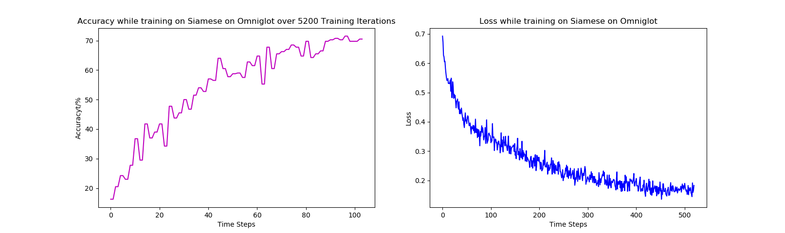
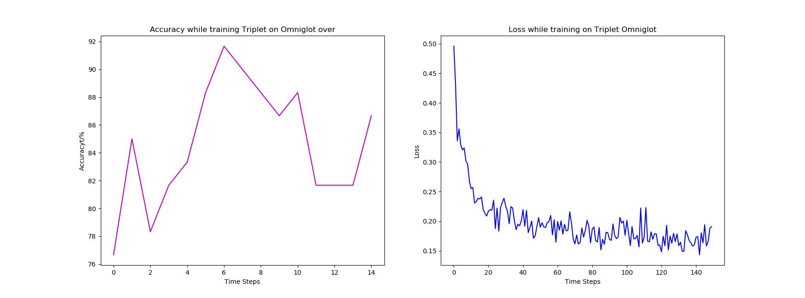

**A journey into few shot learning**

  **By:** Mohammad Mushfequr Rahman **Email:** mohammadmushfequr.rahman@uoit.net  

The fewshot learning problems arises when the data you have is not enough to train a network. One such dataset that we have is the Omniglot dataset. it has nearly 964 characters from 50 different languages with roughly only 20 images for each class. As you can see, this isn't nearly enough datapoints to train a traditional feedforward network. So we must explore other alternatives that will give us acceptable accuracy.

Two ways we can do this is:

    1. Augment the data to increase datapoints i.e Siamese and Triplet Networks

    2. Meta Learning i.e Pretrain the Network in such a way that we can get convergence  on the new task by training the network on a few new datapoints.

Initially we explored Siamese and Triplet Networks on the Omniglot dataset to see how would they do while training over a few iterations.

**Siamese Networks:**
    This type of architecture works by taking in a pair input images and outputs a binary prediction value on whether the two images belong to the same class or not. The image below can help you visulaize how the network works:
    

  Our implementation of Siamese Network have shown similar performance as expected.

  

**Triplet Networks:**
    Triplet Networks are derived from Siamese Networks but they have an additional branch for a negative image example. This network works by minimizing the distance betweeen the **anchor** and the **positive** branch and maximizing the distance between the anchor and the **negative** branch. by using such a technique we can get a faster convergence because we have two new metric to evaluate the correctness on. The output is a binary classification on whther the anchor image belongs to the same class as the positive image.

  

  Our performance with the Triplet Network:
    

**Now we explore meta learning techniques on few shot image baselines:**

**MAML(Model Agnostic Meta Learning)**

 Future plans:

      1.Implement **MTL(Meta Transfer Learning)**

      2.Explore other Methods

  **References:**

  [1] One Shot Learning with Siamese Networks using Keras,
  available online at: https://towardsdatascience.com/one-shot-learning-with-siamese-networks-using-keras-17f34e75bb3d

  [2]Siamese Neural Networks for One-shot Image Recognition,
  available online at: https://www.cs.cmu.edu/~rsalakhu/papers/oneshot1.pdf

  [3] Deep Triplet Ranking Networks for One-Shot Recognition,
  available online at: https://arxiv.org/pdf/1804.07275.pdf

  **Datasets used:**

    1. mini-imagenet
    2. Omniglot
